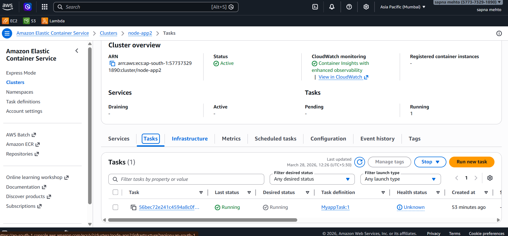
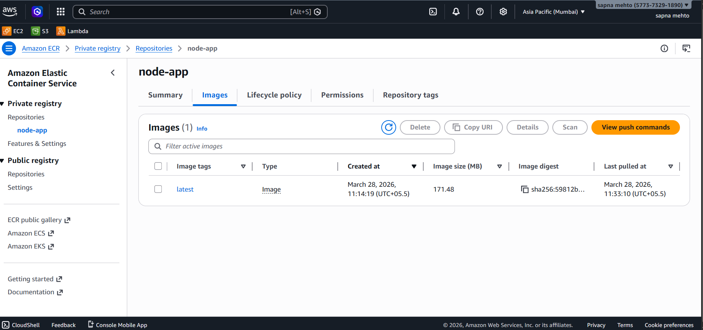
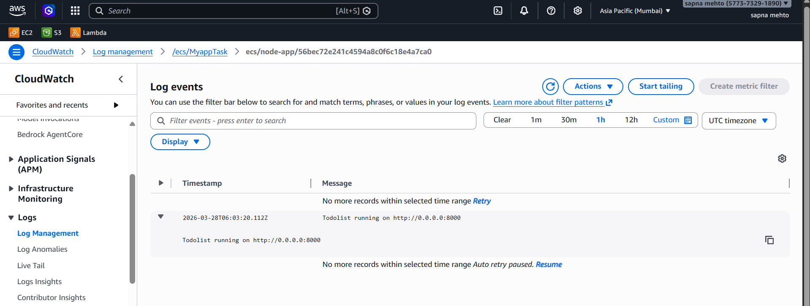

# AWS ECS Docker CI/CD Project

## Project Overview
This project demonstrates deployment of a containerized application using AWS services like ECS, ECR, and CloudWatch.

## Tech Stack
- AWS ECS (Elastic Container Service)
- AWS ECR (Elastic Container Registry)
- Docker
- Git and GitHub
- AWS CloudWatch (Monitoring)

## Architecture
User → Load Balancer → ECS Service → Docker Container → Logs in CloudWatch

## Workflow
1. Code pushed to GitHub  
2. Docker image built  
3. Image pushed to ECR  
4. ECS pulls image and deploys container  
5. Logs monitored in CloudWatch  

## Screenshots

### ECS Service

### ECR Repository

### CloudWatch Logs

## Features
- Containerized deployment  
- Scalable architecture using ECS  
- Centralized logging with CloudWatch  

## Learnings
- Hands-on experience with Docker and AWS  
- Understanding of container orchestration  
- Monitoring using CloudWatch  

## Base Application
This project uses a Node.js application for both frontend and backend, originally created by:
https://github.com/LondheShubham153/node-todo-cicd

I have used this application as a base and implemented:
- Docker containerization  
- Image management using ECR  
- Deployment using ECS  
- Monitoring using CloudWatch  

## Author
Sapna Kumari
